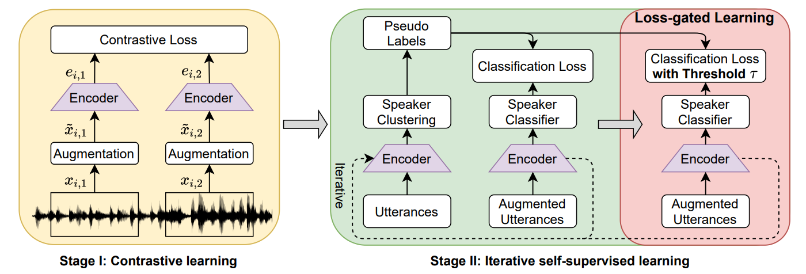

# Self-supervised speaker recognition with LGL

This repository contains the code for our ICASSP 2022 paper: ["Self-supervised speaker recognition with loss-gated learning"](https://arxiv.org/pdf/2110.03869.pdf). We propose to filter the unreliable pseudo label in Stage II, so that train with the reliable pseudo label only to boost the system.



## Result (Train on VoxCeleb2 without labels, test on Vox1_O EER)

| System | Stage 1   | Stage 2 | 
| :-:    | :-:       | :-:     |
|  EER   | 7.36      | 1.66    |

## Difference for our paper and this code

* In our paper, we extend the channel size of speaker encoder to 1024 in the iteration 5, in this code we remove this setting to simply the code. You can do that in the last iteration to get the better result. 

* In our paper, we manually determinate the end of each iteration, that is not user-friendly. In this code, we end the iteration if EER can not improve in continuous N = 4 epochs. You can increase it to improve the performance.

I do not have time to run the entire code again. I have checked Stage 1 and get the EER=7.36. While I believe a EER that smaller than 2.00 can easily be obtained in Stage 2 in this code. 

***

## Dependencies

Note: That is the setting based on my device, you can modify the torch and torchaudio version based on your device.

```
pip install torch==1.7.1+cu110 torchvision==0.8.2+cu110 torchaudio==0.7.2 -f https://download.pytorch.org/whl/torch_stable.html
conda install -c pytorch faiss-gpu
pip install -r utils/requirements.txt
```

## Data preparation

Please follow the official code to perpare your VoxCeleb2 dataset from the 'Data preparation' part in [this repository](https://github.com/clovaai/voxceleb_trainer).

Dataset for training usage: 

1) VoxCeleb2 training set

2) MUSAN dataset;

3) RIR dataset;

Dataset for evaluation:

1) VoxCeleb1 test set for [Vox1_O](https://www.robots.ox.ac.uk/~vgg/data/voxceleb/meta/veri_test2.txt) 

2) VoxCeleb1 train set for [Vox1_E](https://www.robots.ox.ac.uk/~vgg/data/voxceleb/meta/list_test_all2.txt) and [Vox1_H](https://www.robots.ox.ac.uk/~vgg/data/voxceleb/meta/list_test_hard2.txt) (Optional)

I have added the test_list (Vox1_O) in `utils`. This train_list contains the length for each utterances.

`train_mini.txt` is a subset of VoxCeleb2. It contains 100k utterances from 4082 speakers.

Download `train_list.txt` from [here](https://drive.google.com/u/0/uc?id=1eraQWNKNHS_s6SnPjoZrQ_1HOeUREh9R&export=download) and put it in `utils`.

## Stage I: Contrastive Learning

Firstly, you need to train a basic speaker encoder with contrastive learning format, change the path to folder `Stage1` and use:

```
bash run.sh
```

Every `test_step` epoches, system will be evaluated in Vox1_O set and print the EER. 

The result will be saved in `Stage1/exps/exp1/score.txt`. The model will saved in `Stage1/exps/exp1/model`. I also provide the [model](https://drive.google.com/u/0/uc?id=1GTKG04Hs0rr--SOUOYpu9ZTkBT2UZHQk&export=download) that EER=7.36.

In my case, I trained 50 epoches in one 3090 GPU. Each epoch takes 40 mins, the total training time is about 35 hours. 

## Stage II: Classification Training (Baseline)

For the baseline approach in Stage II, change the path to folder `Stage2` and use:

```
bash run_baseline.sh
```

Please modifiy the path for the `init_model` in `run_baseline.sh`. `init_model` is the path for the best model in Stage I.

This is the end-to-end code. System will:

1) Do clustering;

2) Train the speaker encoder for classification

3) Repeat 1) and 2), if the EER in 2) can not improve in continuous 4 epochs.

Here we do 5 iterations. Each epoch takes 20 mins. Clustering takes 18 mins.

## Stage II: Classification Training with LGL (Ours)

For our LGL approach in Stage II, change the path to folder `Stage2` and use:

```
bash run_LGL.sh
```

This is also end-to-end code. System will:

1) Do clustering;

2) Train the speaker encoder for classification

3) Train the speaker encoder for classification with LGL, if the EER in 2) can not improve in continuous 4 epochs.

4) Repeat 1) 2) and 3), if the EER in 3) can not improve in continuous 4 epochs.

## Notes:

I have already added annotation to make the code as clear as possible, please read them carefully. If you have questions, please post them in `issue` part.

## Reference
```
@inproceedings{tao2022self,
  title={Self-supervised speaker recognition with loss-gated learning},
  author={Tao, Ruijie and Lee, Kong Aik and Das, Rohan Kumar and Hautam{\"a}ki, Ville and Li, Haizhou},
  booktitle={ICASSP 2022-2022 IEEE International Conference on Acoustics, Speech and Signal Processing (ICASSP)},
  pages={6142--6146},
  year={2022},
  organization={IEEE}
}
```

## Acknowledge

We study many useful projects in our codeing process, which includes:

[clovaai/voxceleb_trainer](https://github.com/clovaai/voxceleb_trainer).

[joonson/voxceleb_unsupervised](https://github.com/joonson/voxceleb_unsupervised).

[lawlict/ECAPA-TDNN](https://github.com/lawlict/ECAPA-TDNN/blob/master/ecapa_tdnn.py).

Thanks for these authors to open source their code!

### Cooperation

If you are interested to work on this topic and have some ideas to implement, I am glad to collaborate and contribute with my experiences & knowlegde in this topic. Please contact me with ruijie.tao@u.nus.edu.
